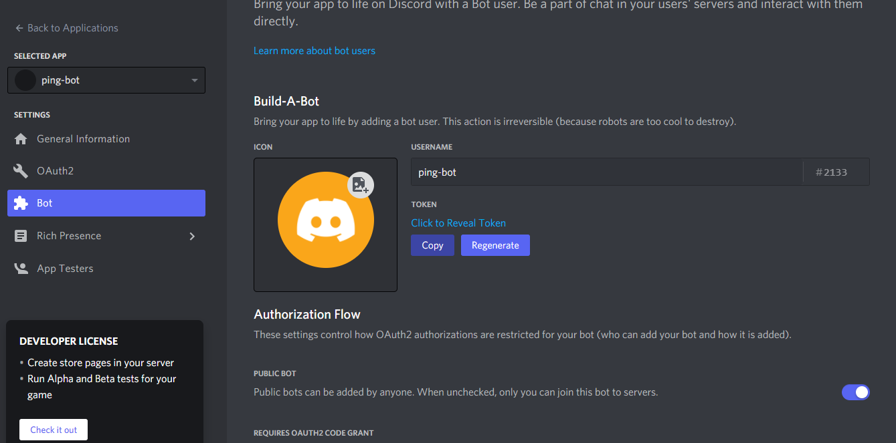
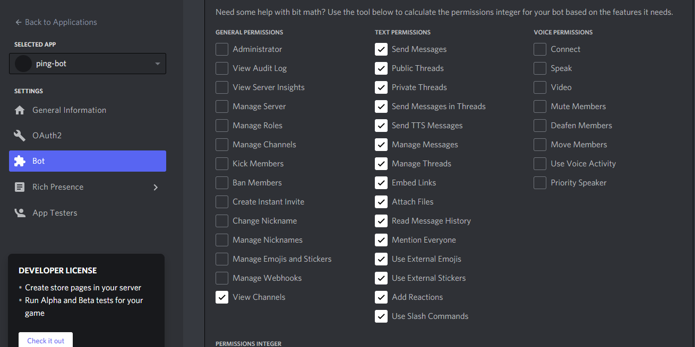

> # Discord Bot in Golang.

<h3>
  In this we will be creating a simple discord bot which return **pong** when we type **ping** . 

  For this you have to be admin of a server on discord if you aren't already or create a new server for this project use . Go to [**Developer Portal**](https://discord.com/developers/applications) in your browser and click on **New Application** on top right side , name the app as **ping-bot** then click create. You can be able to see your **Application Id** and **Public Key** . Go to bot section which is on mid left side ,copy your **Bot-Token** and save it somewhere for future use .<br>
  
  
  Then scroll to lower most section of bot page check all of these permissions.
  
  

  After this copy this link `"https://discordapp.com/oauth2/authorize?client_id=[CLIENTID]&scope=bot"`and replace **Client Id** with your **Application Id** and search it in you brower . There should be an option to choose your discord server , choose that server in which you are admin. After that you will be able to see **ping-bot** in your user column on right side . But it won't reply **pong** when we type **ping** currently. 
  
  Create a **config.json** file , which will store our **Bot-Token** and **BotPrefix** . We will create a function to read this file later.


  ```json
"Token"  : "[put-your-copied-bot-token-here]",
"BotPrefix" : "!"
  ```
  ##  Creating Main.go file 

   First create a folder & name it **GOLANG-DISCORD-BOT** . Open your **Powershell** , navigate to your **GOLANG-DISCORD-BOT** , run these command :

   1. To create a go.mod file init `go mod init golang-discord-bot`. 
   2. `go mod tidy` just a requirement.
   3. `go get "github.com/bwmarrin/discordgo"` this is a package which we will be using to create our discord bot in Golang .

  Create a **main.go** file , we will be importing three packages :

  ```go
package main

import (
	"fmt"
	"golang-discord-bot/bot" //we will create this later
	"golang-discord-bot/config" //we will create this later
) 
  ``` 


  Inside func main we have a **config.ReadConfig** function which we will create inside our **config.go** file , it will be used to read our **config.json** file , to check for error we will use if statements.

  ```go
     err := config.ReadConfig()

	if err != nil {
		fmt.Println(err.Error())
		return
	}

  ```
  Then we will use **"golang-discord-bot/bot"** package for **bot.Start()** ,we will create it later. Atlast we will have `<-make(chan struct{})` to make chan struct , then we will return from our function. 

  Our final main funciton will look like this :

  ```go
  package main

import (
	"fmt"
	"golang-discord-bot/bot"
	"golang-discord-bot/config"
)

func main() {
	err := config.ReadConfig()

	if err != nil {
		fmt.Println(err.Error())
		return
	}

	bot.Start()

	<-make(chan struct{})
	return
}
```

## Creating config.go function 

Go to your **GOLANG-DISCORD-BOT** > create a folder name as **config** > inside it create a file name **config.go** we will work in it.

Inside **config.go** file , import these packages : 
```go
package config

import (
	"encoding/json" 
	"fmt" //used to print errors majorly.
	"io/ioutil" //it will be used to help us read our config.json file.
)

```

We will declare three variables and one struct named as **configStruct** : 

```go
var (
	Token     string //To store value of Token from config.json .
	BotPrefix string // To store value of BotPrefix from config.json.

	config *configStruct //To store value extracted from config.json.
)

type configStruct struct {
	Token     string `json : "Token"`
	BotPrefix string `json : "BotPrefix"`
}
```
Definition of **ReadConfig()** function which will return an error if occurred . 

```go
func ReadConfig() error {
	fmt.Println("Reading config file...")
	file, err := ioutil.ReadFile("./config.json") // ioutil package's ReadFile method which we read config.json and return it's value we will then store it in file variable and if an error ocurrs it will be stored in err .

//Handling error and printing it using fmt package's Println function and returning it .
	if err != nil {
		fmt.Println(err.Error())
		return err
	}
    
// We are here printing value of file variable by explicitly converting it to string .

	fmt.Println(string(file))
// Here we performing a simple task by copying value of file into config variable which we have declared above , and if there any error we are storing it in err . Unmarshal takes second arguments reference remember it .
	err = json.Unmarshal(file, &config)

//Handling error 
	if err != nil {
		fmt.Println(err.Error())
		return err
	}

// After storing value in config variable we will access it and storing it in our declared variables .
	Token = config.Token
	BotPrefix = config.BotPrefix

//If there isn't any error we will return nil.
	return nil

}
```

 ## Creating bot.go file 

 Go to your **GOLANG-DISCORD-BOT** > create a folder name as **bot** > inside it create a file name **bot.go** we will work in it. 

 Inside **bot.go** we will import these packages :

 ```go
package bot

import (
	"fmt" //to print errors
	"golang-discord-bot/config" //importing our config package which we have created above

	"github.com/bwmarrin/discordgo" //discordgo package from the repo of bwmarrin . 
)
 ```
Declaring two variables , first one will be **BotId** which is a string it will store id of bot after making it a user . Second one is **goBot** which is of type **discordgo.Session** . 

```go
var BotId string
var goBot *discordgo.Session
```

 Creating **Start** function

```go
func Start() {

    //creating new bot session
	goBot, err := discordgo.New("Bot " + config.Token)

//Handling error
	if err != nil {
		fmt.Println(err.Error())
		return
	}
// Making our bot a user using User function .
	u, err := goBot.User("@me")
//Handlinf error
	if err != nil {
		fmt.Println(err.Error())
		return
	}
// Storing our id from u to BotId .
	BotId = u.ID

// Adding handler function to handle our messages using AddHandler from discordgo package. We will declare messageHandler function later.
	goBot.AddHandler(messageHandler)


	err = goBot.Open()
//Error handling
	if err != nil {
		fmt.Println(err.Error())
		return
	}
    //If every thing works fine we will be printing this.
	fmt.Println("Bot is running !")
}

//Definition of messageHandler function it takes two arguments first one is discordgo.Session which is s , second one is discordgo.MessageCreate which is m.
func messageHandler(s *discordgo.Session, m *discordgo.MessageCreate) {
    //Bot musn't reply to it's own messages , to confirm it we perform this check.
	if m.Author.ID == BotId {
		return
	}
  //If we message ping to our bot in our discord it will return us pong .
	if m.Content == "ping" {
		_, _ = s.ChannelMessageSend(m.ChannelID, "pong")
	}
}
```

So with this our discord bot is completed . You can check it by going to your discord server and messaging *ping* to your bot it will reply *pong* .

Thank you for reading this .

Feel free to fork this repo and use this code.

   

</h3>
